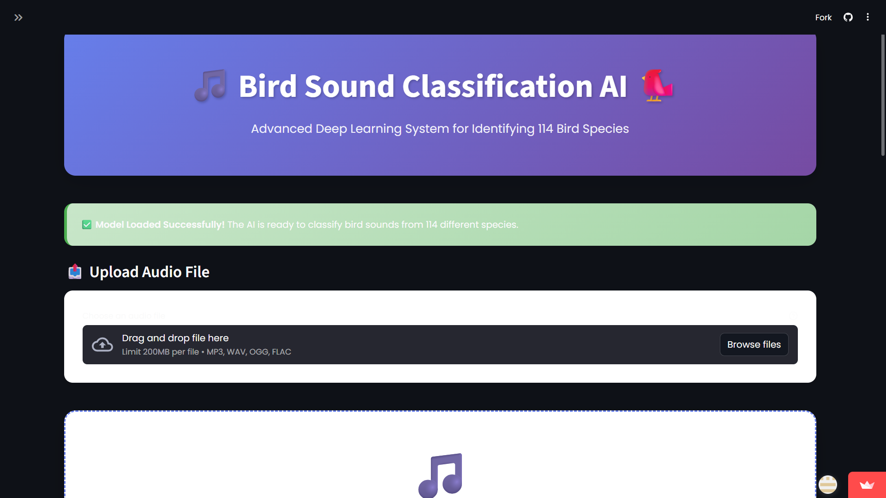

# 🐦 KooKoo AI — Bird Sound Classification


A deep learning web app that identifies bird species from audio recordings. Upload a bird call (MP3, WAV, OGG, or FLAC), and a trained CNN model predicts the species from 114 possible classes, along with confidence scores, top-5 predictions, and audio visualizations (waveform + MFCC heatmap).

### 🚀 Live Demo

**[👉 Try it live on Streamlit Cloud](https://kookoo-bird-sound-classification.streamlit.app)**

> No audio handy? Just click **"Try a Sample Bird Call"** inside the app to see it in action instantly.



## Features

- 🎯 Bird species classification across 114 species
- 📊 Top-5 predictions with confidence scores
- 🌊 Waveform and MFCC feature visualizations
- 🎵 One-click sample audio to demo the app instantly
- 🛡️ Graceful handling of silent / too-short / invalid audio
- 💾 Downloadable prediction results (CSV)
- 🎧 In-browser audio playback
- 📱 Responsive, glassmorphism UI

## How It Works

1. Audio is loaded with `librosa` at its native sample rate.
2. 40 MFCC (Mel-Frequency Cepstral Coefficients) are extracted and averaged across time.
3. The feature vector is fed into a trained CNN (`bird_model.h5`, Keras/TensorFlow).
4. The model outputs a probability distribution over 114 bird species, mapped via `prediction.json`.

## Tech Stack

- **Frontend/App:** [Streamlit](https://streamlit.io/)
- **ML:** TensorFlow / Keras (CNN)
- **Audio processing:** librosa, soundfile
- **Visualization:** Plotly, Pandas

## Running Locally

### Prerequisites
- Python 3.11 (recommended — TensorFlow does not yet support 3.13+)
- ~500 MB free disk space for dependencies

### Setup

```bash
git clone https://github.com/meenaprajapat/Bird-Sound-Classification.git
cd Bird-Sound-Classification

# Create and activate a virtual environment
python -m venv venv
venv\Scripts\activate        # Windows
source venv/bin/activate     # macOS/Linux

# Install dependencies
pip install -r requirements.txt

# Run the app
streamlit run app.py
```

The app will open at `http://localhost:8501`.

## Project Structure

```
├── app.py                  # Streamlit UI (thin — delegates to src/ modules)
├── src/
│   ├── model_loader.py     # Loads the CNN model + label mapping
│   ├── audio_processing.py # Audio loading, validation, MFCC extraction
│   ├── predictor.py        # Runs inference, formats top-K results
│   ├── visualizations.py   # Plotly waveform / MFCC / prediction charts
│   └── styles.py           # Custom glassmorphism CSS theme
├── tests/
│   └── test_pipeline.py    # Unit tests for the inference pipeline (pytest)
├── bird_model.h5           # Trained CNN model
├── prediction.json         # Class index -> species name mapping
├── sample_bird_call.ogg    # Bundled demo audio for the "Try a Sample" button
├── requirements.txt        # Python dependencies (pinned)
├── requirements-dev.txt    # Dev/test dependencies (pytest)
├── packages.txt            # System packages for Streamlit Cloud (libsndfile)
├── runtime.txt             # Pins Python 3.11 on Streamlit Cloud
├── .streamlit/config.toml  # Streamlit theme & server config
└── screenshots/            # App screenshots for documentation
```

## Running Tests

```bash
pip install -r requirements-dev.txt
pytest -q
```

## Deployment (Streamlit Community Cloud — Free)

This repo is ready to deploy as-is:

1. Push this repo to GitHub (already done if you're reading this on GitHub).
2. Go to [share.streamlit.io](https://share.streamlit.io) and sign in with GitHub.
3. Click **New app**, select this repository, branch `main`, and set the main file path to `app.py`.
4. Click **Deploy**. Streamlit Cloud will install `requirements.txt` and the system packages in `packages.txt` automatically.
5. First load may take a minute while the model loads — subsequent loads are cached (`@st.cache_resource`).

Your app will be live at `https://<your-app-name>.streamlit.app`.

## Model Notes

- Input: 40 MFCC coefficients (mean-aggregated across time), reshaped to `(1, 40, 1)`.
- Output: 114-way softmax over bird species.
- Reported test accuracy: ~65%.
- The model was trained on a specific set of 114 species (mostly Tinamous, Guans,
  Megapodes, and other ground/ratite birds). Recordings of species outside this set
  will naturally produce low-confidence predictions — the app flags these clearly.

## Author

**Meena**
[GitHub](https://github.com/meenaprajapat) · [LinkedIn](https://www.linkedin.com/in/meena-a166b4200)
